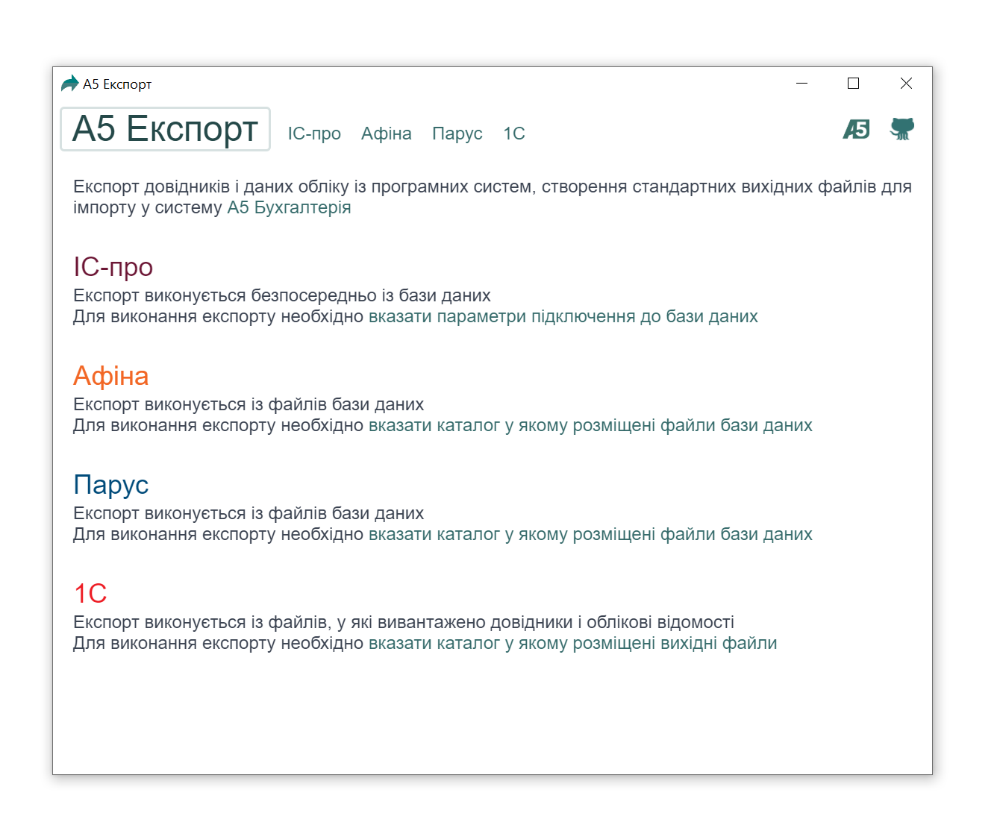

MultiExport 
============
The MultiExport application, which prepares files for import into the "A5 Systems" database.

Preview
-------


Download
--------
<a href="./dist/" download>Binaries for MS Windows</a>

Afrer clone from repository
---------------------------
```
yarn
yarn test
yarn start
```

To make executable file
-----------------------
```
yarn
yarn run dist
```
Then you can find the executable file in the .\dist subdirectory.

Environment variables
---------------------
[The Medium article how to use environment variables](https://medium.com/the-node-js-collection/making-your-node-js-work-everywhere-with-environment-variables-2da8cdf6e786)

Create .env file, put into it the next content and fill fields
```
NODE_ENV=development

# Set your database connection information here
SERVER=
LOGIN=
PASSWORD=
SCHEMA=
SCHEMASYS=

```

Notes about the SQL Server configuration to make connection
------------------------------------------------------------
[Configure a Windows Firewall for Database Engine Access](https://docs.microsoft.com/en-us/sql/database-engine/configure-windows/configure-a-windows-firewall-for-database-engine-access?view=sql-server-ver15)

Configure SQL Server access protocols:
* Run SQL Server Configuration Manager
* Find SQL Server Network Configuration\Protocol for [Your Server Name]
* In the right pane turn on Status Enabled for TCP/IP and Shared Memory protocols
* Then make double click on the TCP/IP protocol and in the opened dialog box find the IPAll section: 
    * Write 0 in TCP Dynamic ports 
    * Write 1433 in TCP Port
